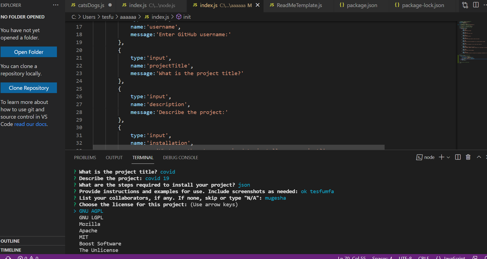

<h1 align='center'></h1>
  <h1 align='center'>README.md Generator</h1>

<h3>User Story</h3>

AS A developer 
I WANT a README generator 
SO THAT I can quickly create a professional README for a new project

<h3>Acceptance Criteria</h3>

 GIVEN a command-line application that accepts user input 
WHEN I am prompted for information about my application repository 
THEN a high-quality, professional README.md is generated with the title of my project  
and sections entitled Description, Table of Contents, 
Installation, Usage, License, Contributing, Tests, and Questions 
WHEN I enter my project title 
THEN this is displayed as the title of the README 
WHEN I enter a description, installation instructions, usage information, 
contribution guidelines, and test instructions 
THEN this information is added to the sections of the README entitled  
Description, Installation, Usage, Contributing, and Tests 
WHEN I choose a license for my application from a list of options 
THEN a badge for that license is added near the top of the README and a  
notice is added to the section of the README entitled License that explains  
which license the application is covered under 
WHEN I enter my GitHub username 
THEN this is added to the section of the README entitled Questions, 
with a link to my GitHub profile 
WHEN I enter my email address 
THEN this is added to the section of the README entitled Questions, with  
instructions on how to reach me with additional questions 
WHEN I click on the links in the Table of Contents 
THEN I am taken to the corresponding section of the README 

<h3>To Getting Started</h3>

 these module and packages are included to run approprately ,these are node_modules/ and .DS_Store/ in  
.gitignore file package.json and 

  ## Description 

    dynamically generates README.md file
    ## Table of Contents
  - [Description](#description)
  - [Contributing](#contributing)
  -  ## Installation

    install node.js, install inquirer pack/node_modules/util pack

  ## Usage

    create JavaScript files to dynamically render a README file

  ## Credits

    N/A  

  ## License
    This application is covered by GNU AGPL license.
    This application is covered by Mozilla license.

  ## Features

    Javascript, node.js, json

  ## Contributing

    N/A
## screenshot

##   video animation presentation

